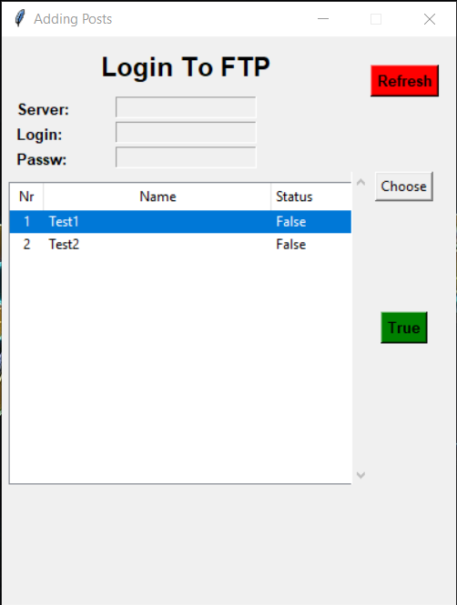

# gui_for_uploading_posts
 Gui for publish posts create in tkinter, in short: move data from sharepoint to website administrator panel and some files to ftp server.
* Some Data anonimized

## Screenshot
 

## Requirements
* [Python 3.10.4+](https://www.python.org/downloads)

## Pip
* beautifulsoup4
* Pandas
* requests
* requests-ntlm3
* urllib3
